# End-to-End MLOps Pipeline

This repository implements a **production-style MLOps lab**: source control, automated tests, infrastructure as code on AWS, containerized microservices, continuous delivery to EC2, and observability with Prometheus and Grafana. The step-by-step goals and grading criteria for your course are in **`assigmnet-lab.pdf`** at the project root (use that document alongside this README).

---

## What you are building (conceptually)

You are not only “running containers.” You are wiring together a **repeatable path** from commit to running system:

1. **Application code** exposes HTTP APIs and machine-oriented metrics.
2. **CI** runs automated tests so regressions are caught before deployment.
3. **IaC** declares cloud networking and a compute host so environments are reproducible.
4. **Registry** stores immutable images; the server pulls tagged artifacts instead of building by hand.
5. **CD** SSHs into the host, ensures Docker is available, and starts the stack.
6. **Observability** scrapes `/metrics` and dashboards answer “is the system healthy?”

That loop—**test → provision → build → deploy → observe**—is the core idea of MLOps-style delivery for services (even when the “model” is a placeholder).

---

## Architecture

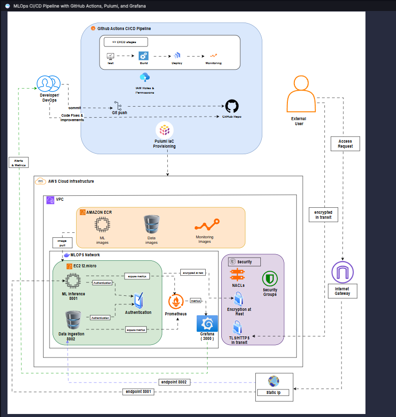

**End-to-end flow**

1. A developer pushes to GitHub (`main` or a PR for tests).
2. **GitHub Actions** runs the workflow in `.github/workflows/deploy.yml`.
3. **Pulumi** (Python, `infrastructure/__main__.py`) creates a VPC, subnet, routes, security group, Ubuntu EC2 instance, and an Elastic IP.
4. **Docker images** for `ml-inference` and `data-ingestion` are built and pushed to **Docker Hub**.
5. The workflow **SSHs into EC2** as `ubuntu`, writes Prometheus/Grafana config and a production `docker-compose.yml`, then runs `docker-compose up -d`.
6. **Prometheus** scrapes each service’s `/metrics`; **Grafana** visualizes the time series (provisioned under `monitoring/grafana/`).

---

## Tech stack

| Area | Tools |
|------|--------|
| CI/CD | GitHub Actions |
| IaC | Pulumi + `pulumi-aws` |
| Cloud | AWS (EC2, VPC, EIP, security groups) |
| Containers | Docker, Docker Compose, Docker Hub |
| Services | Flask, `prometheus_client` |
| Monitoring | Prometheus, Grafana |
| API / regression tests | pytest (CI), Postman collection (manual or runner) |

---

## Repository layout

```
mlops-pipeline/
├── assigmnet-lab.pdf              # Course assignment (PDF)
├── MLOps_Pipeline_Collection.json # Postman collection (import locally; see below)
├── .github/workflows/deploy.yml   # CI/CD pipeline
├── infrastructure/                # Pulumi program (AWS stack)
│   ├── __main__.py
│   ├── Pulumi.yaml
│   └── requirements.txt
├── services/
│   ├── ml-inference/              # Port 8001 — /predict, /health, /metrics
│   └── data-ingestion/            # Port 8002 — /ingest, /data, /health, /metrics
├── monitoring/
│   ├── prometheus/                # scrape config, alerts
│   └── grafana/                   # datasources, dashboards
├── docker-compose.yml             # Local multi-service stack
├── images/                        # Screenshots for setup & Postman
└── README.md
```

---

## Core services (conceptual code walkthrough)

### ML inference (`services/ml-inference/app.py`)

The service is a small Flask app that simulates inference: it validates JSON input, runs a **dummy** model (random output in `[0, 1)`), and returns a versioned payload. It also increments **Prometheus** counters and histograms so you can correlate traffic with latency in Grafana.

**Ideas illustrated**

- **Contract**: `POST /predict` expects `{"features": [...]}`; missing `features` → `400`.
- **Observability**: `Counter` / `Histogram` from `prometheus_client`; `GET /metrics` exposes the exposition format Prometheus scrapes.
- **Operations**: `GET /health` returns JSON the Postman tests assert on.

```python
# Simplified illustration of the prediction path (see app.py for full code)
@app.route('/predict', methods=['POST'])
def predict():
    data = request.get_json()
    if not data or 'features' not in data:
        return jsonify({'error': 'No features provided'}), 400
    prediction = model.predict(data['features'])
    prediction_counter.inc()
    return jsonify({
        'prediction': float(prediction),
        'model_version': '1.0.0',
        'timestamp': time.time()
    }), 200
```

### Data ingestion (`services/data-ingestion/app.py`)

This service accepts arbitrary JSON, attaches **metadata** (timestamp, source IP, monotonic id), stores rows **in memory** (fine for a lab; production would use a DB or queue), and exposes the same metrics pattern as inference.

**Ideas illustrated**

- **Idempotent-ish storage**: append-only list with server-assigned `id`.
- **Read paths**: `GET /data/<id>` and `GET /data?limit=N` support demos and Postman chaining.
- **Metrics**: ingestion count, duration, and payload size histogram.

```python
# Simplified illustration (see app.py)
ingestion_record = {
    'data': payload,
    'timestamp': datetime.utcnow().isoformat(),
    'source_ip': request.remote_addr,
    'id': len(data_store) + 1
}
data_store.append(ingestion_record)
return jsonify({'status': 'success', 'id': ingestion_record['id'], ...}), 201
```

### Local orchestration (`docker-compose.yml`)

Compose builds both Flask images, attaches them to `mlops-network`, and runs Prometheus + Grafana with mounted config. Service DNS names (`ml-inference`, `data-ingestion`) match the scrape targets in `monitoring/prometheus/prometheus.yml`.

---

## Infrastructure as code (`infrastructure/__main__.py`)

Pulumi defines **everything the EC2 instance needs to be reachable and useful**:

- **VPC** `10.0.0.0/16`, **public subnet** `10.0.1.0/24`, **internet gateway**, **route** `0.0.0.0/0` → IGW.
- **Security group** allowing SSH (22), app ports **8001**, **8002**, **9090**, **3000** from `0.0.0.0/0` (convenient for labs; tighten for real workloads).
- **EC2** `t2.micro`, Ubuntu 22.04 AMI in `ap-southeast-1`, with **user_data** that installs Docker, Docker Compose v2, and AWS CLI v2, then writes `/home/ubuntu/setup-info.txt` when ready.
- **Elastic IP** associated with the instance so the public address is stable for Postman and dashboards.

**Important outputs** (consumed by GitHub Actions): `instance_public_ip`, `unique_suffix`, plus URLs for Grafana and Prometheus.

The stack name in the workflow is set via `PULUMI_STACK` (for example `faizulkhan/mlops-pipeline/sandbox` in `deploy.yml`). If you fork the repo, create your own Pulumi org/project/stack and update that variable.

---

## CI/CD pipeline (`.github/workflows/deploy.yml`)

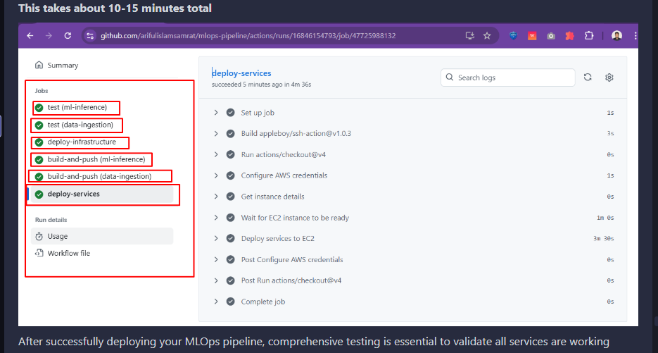

**Job: `test`**

- Matrix over `ml-inference` and `data-ingestion`.
- Installs `requirements.txt`, runs **pytest** when a `tests/` folder exists; otherwise imports the Flask app and hits `/health`.

**Job: `deploy-infrastructure`** (only on `main` after tests pass)

- Configures AWS credentials from secrets.
- Installs Pulumi CLI, optionally destroys and recreates the stack (fresh start), then `pulumi up`.
- Exports `instance_ip` and `unique_suffix` from `pulumi stack output`.

**Job: `build-and-push`**

- Logs in to Docker Hub using `DOCKERHUB_USERNAME` / `DOCKERHUB_TOKEN` secrets.
- Builds each service image, tags with `${{ github.sha }}` and `latest`, pushes both.

**Job: `deploy-services`**

- Waits for **SSH** on port 22, then uses `appleboy/ssh-action` with `EC2_SSH_KEY`.
- On the server: ensures Docker is running, writes Prometheus and Grafana provisioning files, writes a **`docker-compose.yml` that references published images** (the workflow embeds image names such as `faizul56/ml-inference:latest`—**change these to match your Docker Hub username** if you are not using the same account).
- `docker-compose pull` / `up -d`, then curls **health** endpoints on 8001, 8002, 9090, 3000.

**Conceptual snippet** (structure of the workflow—not a copy of the whole file):

```yaml
# Conceptual shape of deploy.yml
jobs:
  test:            # pytest / health checks per service
  deploy-infrastructure:
    needs: test
    # pulumi up → EC2 + EIP
  build-and-push:
    needs: deploy-infrastructure
    # docker build & push to Docker Hub
  deploy-services:
    needs: [deploy-infrastructure, build-and-push]
    # ssh → docker-compose up on EC2
```

---

## Prerequisites and secrets

### AWS CLI

Configure a profile or default credentials with permission to manage EC2, VPC, and related resources in the target region (`ap-southeast-1` in this project).

```bash
aws configure
```

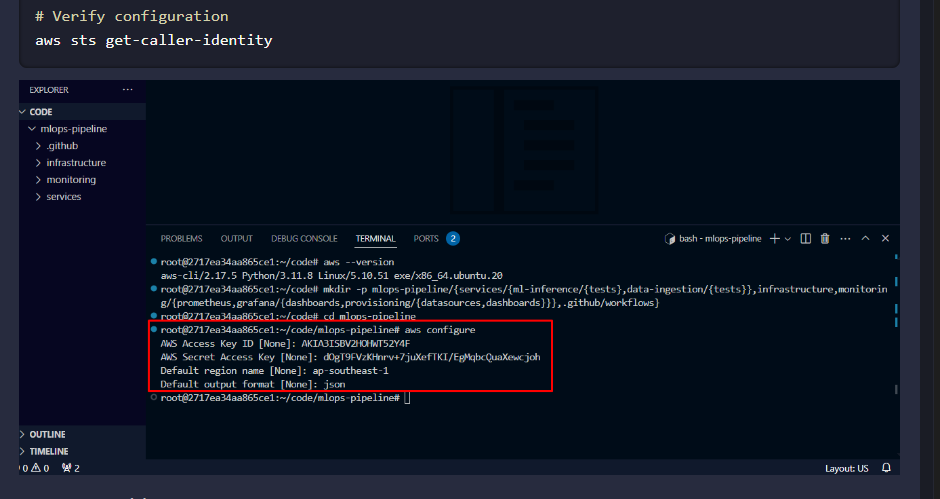

### SSH key pair (local + GitHub)

Generate a key pair. Store the **private** key in GitHub as `EC2_SSH_KEY` (full PEM text). Store the **public** key as `SSH_PUBLIC_KEY` (single line, `ssh-rsa ...`). Pulumi registers the public key as an AWS key pair so you can SSH to the instance.

```bash
ssh-keygen -t rsa -b 4096 -f mlops-key -N ""
```

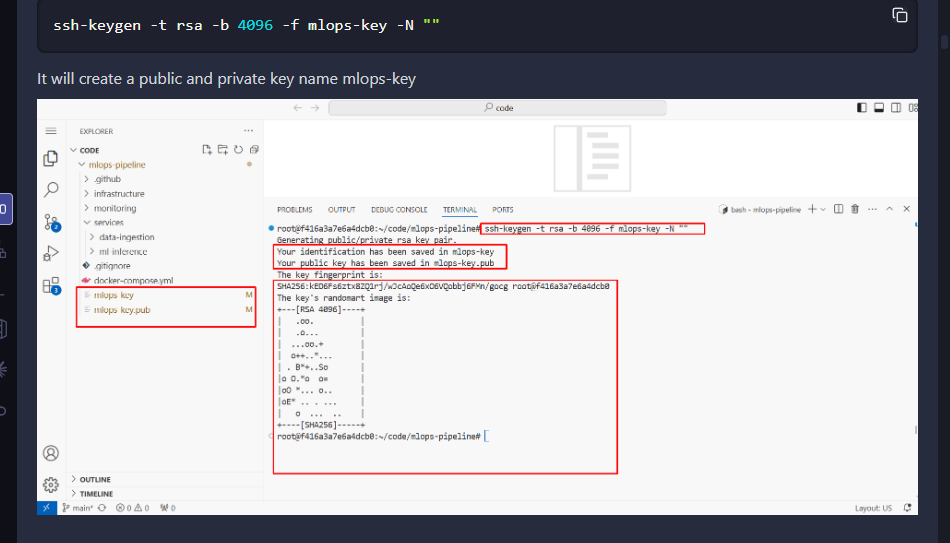

### GitHub repository secrets

In **GitHub → Settings → Secrets and variables → Actions**, add at least:

| Secret | Role |
|--------|------|
| `AWS_ACCESS_KEY_ID` / `AWS_SECRET_ACCESS_KEY` | Used by `configure-aws-credentials` for Pulumi |
| `AWS_DEFAULT_REGION` | Should match stack region if you rely on it elsewhere |
| `EC2_SSH_KEY` | Private key for `appleboy/ssh-action` |
| `SSH_PUBLIC_KEY` | Passed into Pulumi for `aws.ec2.KeyPair` |
| `PULUMI_ACCESS_TOKEN` | Non-interactive `pulumi login` in CI |
| `DOCKERHUB_USERNAME` / `DOCKERHUB_TOKEN` | Push and pull images |

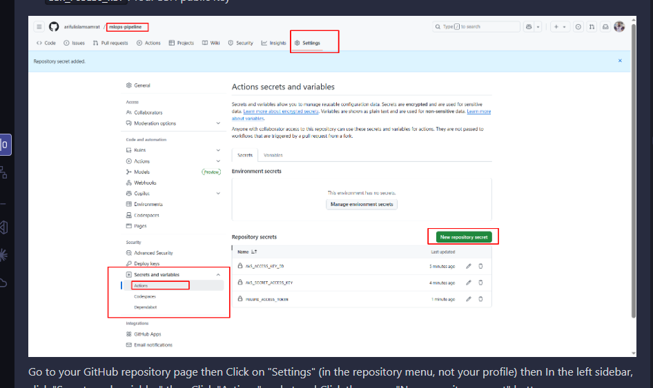

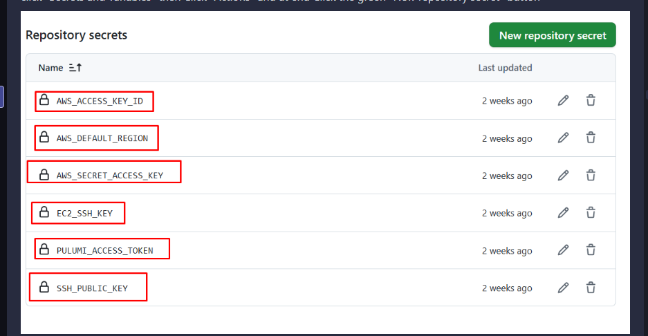

### Pulumi access token

Create a token at [Pulumi Cloud tokens](https://app.pulumi.com/account/tokens) and add it as `PULUMI_ACCESS_TOKEN`.

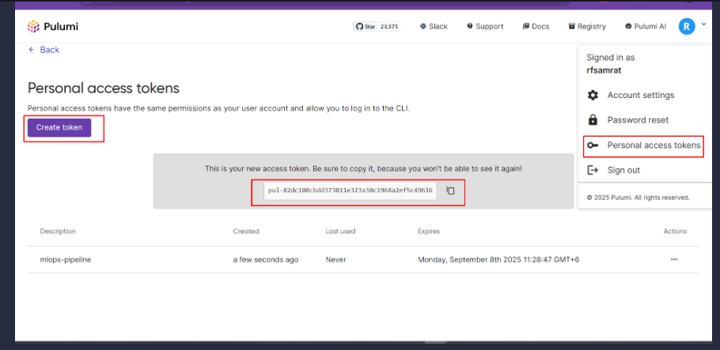

---

## Postman: `MLOps_Pipeline_Collection.json`

At the **project root** you will find:

**`MLOps_Pipeline_Collection.json`**

This file is a **Postman Collection v2.1** export. It is not tied to a specific machine path: **copy or download it to any folder on your computer** (Desktop, Documents, etc.), then import it into Postman.

### Import the collection

1. Open Postman.
2. **Import** → choose **`MLOps_Pipeline_Collection.json`** from wherever you saved it.

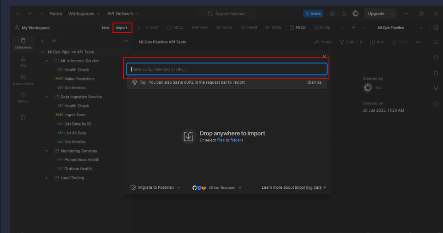

### Point requests at your EC2 host

The collection uses a variable **`base_url`**. Requests are shaped like `{{base_url}}:8001/health`, so `base_url` must be the **origin only**, typically:

`http://<YOUR_EC2_PUBLIC_IP>`

- Do **not** include a trailing slash on `base_url`.
- Ports **8001**, **8002**, **9090**, and **3000** are appended per request in the collection.

After Pulumi (or the AWS console) gives you the instance’s **Elastic IP** or public IP:

1. In Postman, open the collection **Variables** (or use an Environment).
2. Set **`base_url`** to `http://<EC2_PUBLIC_IP>` (replace with your real IP).

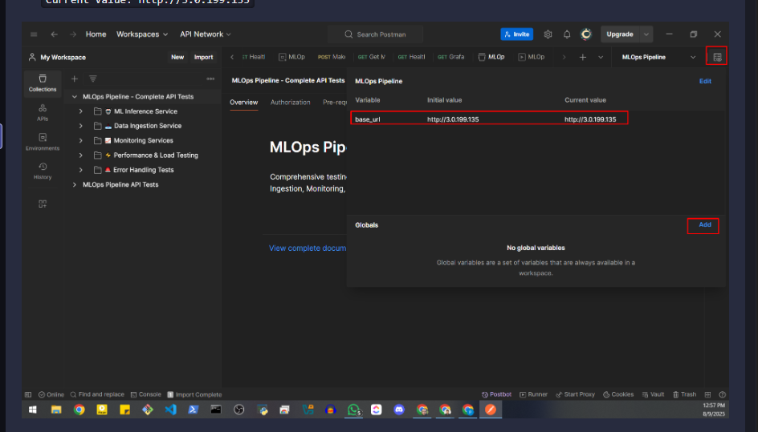

The file ships with an example value (such as `http://3.0.199.135`); **always replace it** with your current IP after each deploy.

Optional: tests may set **`current_data_id`** automatically after a successful ingest; you usually do not set that by hand.

### Run tests

Use Postman’s **Collection Runner** (or send requests individually). The collection includes **test scripts** (assertions on status codes, JSON shape, Prometheus queries, etc.).

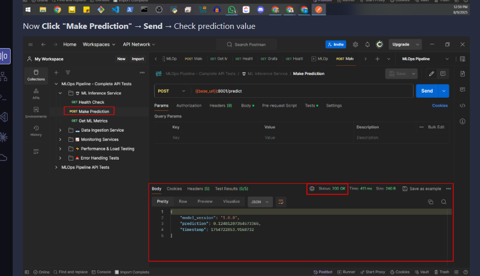

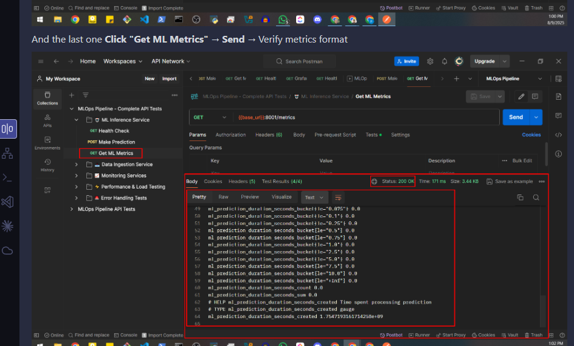

---

## After deployment: URLs and ports

| Service | URL pattern | Notes |
|---------|-------------|--------|
| ML inference | `http://<EC2_IP>:8001` | `/health`, `/predict`, `/metrics` |
| Data ingestion | `http://<EC2_IP>:8002` | `/health`, `/ingest`, `/data`, `/metrics` |
| Prometheus | `http://<EC2_IP>:9090` | UI and PromQL API |
| Grafana | `http://<EC2_IP>:3000` | Default admin password is set to `admin` in compose (change in production) |

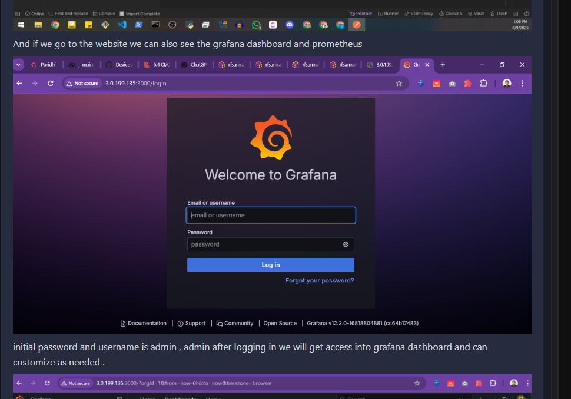

Pulumi also exports `grafana_url` and `prometheus_url` built from the Elastic IP.

---

## Local development (optional)

From the repo root:

```bash
docker compose up --build
```

Then use `http://localhost` as the host in Postman with the same ports, e.g. set `base_url` to `http://localhost`.

Run pytest per service:

```bash
cd services/ml-inference && pip install -r requirements.txt pytest && pytest tests/ -v
cd services/data-ingestion && pip install -r requirements.txt pytest && pytest tests/ -v
```

---

## Limitations (by design for the lab)

- **No real training pipeline**; inference uses a random “prediction” in a fixed range.
- **In-memory** ingestion store only; data is lost when the process restarts.
- **Security group** allows broad ingress on application ports; acceptable for a sandbox, not for production.

---

## Possible extensions

- Swap the dummy model for a real artifact (pickle, ONNX, or HTTP sidecar) and version it with image tags.
- Persist ingestion to S3, RDS, or DynamoDB.
- Add **MLflow** or a feature store for experiment tracking.
- Move from single EC2 to ECS/EKS for horizontal scaling.

---

## Author

**Faizul Khan**

If this README helped you complete **`assigmnet-lab.pdf`**, consider leaving a star on the repository.
